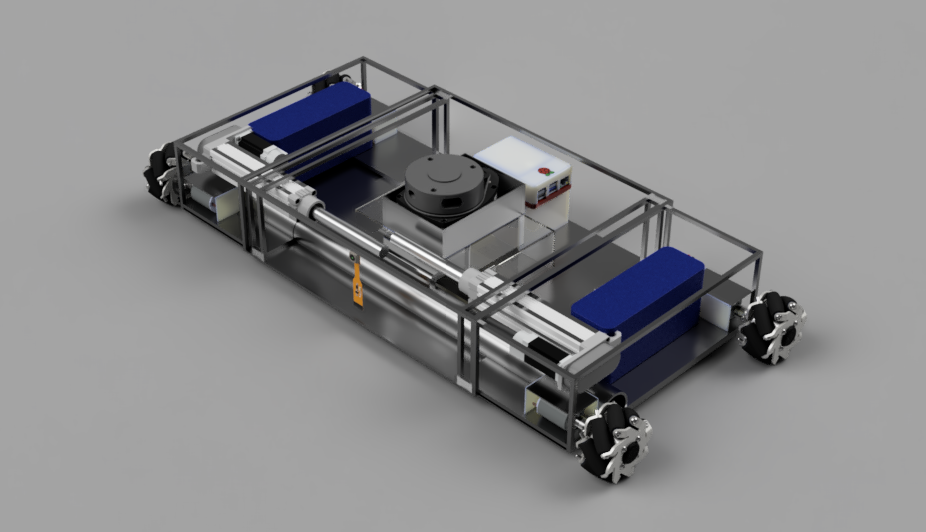
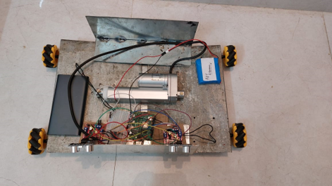

# ABSTRACT

Cleaning robots have advanced significantly in recent years, owing to their increased market presence and the desire for improved performance in cleaning. However, owing to their geometric restrictions with respect to the cleaning area, most robots have difficulty in cleaning the entire area. The robot developed in this paper uses on-board sensors, including ultrasonic sensors and camera to detect obstacles, change the robot configuration accordingly, and navigate forward, backward and even sideways with the help of Mecanum wheels. A ball screw linear actuator has been used to change the length of the robot according to what it maps about the room using the sensors. To achieve this, a precise CAD model has been developed according to the decided parameters. A functional prototype has also been developed as a proof of concept and it has been compared with a simulation study done in CoppeliaSim software.

---

**Work Done**

* Finalized the components and sensors for use in the robot
* Designed a CAD model using Fusion 360
* Calculated the Wheel Motor Torque requirements and the Battery Life
* Conducted a Simulation study in CoppeliaSim (V-REP)
* Programmed the Robot and Sensors using Raspberry Pi 4
* Conducted a Static Stress Analysis on the chassis of the robot using Ansys
* Built a Functional Prototype

---

# CONCLUSION

A simulation study has been demonstrated to verify the efficacy of the system. Further, a functional prototype has been developed as a proof of concept to test the system in the real world. A static stress analysis has been conducted to determine the factor of safety of the chassis, which is the main load bearing element of the robot. Since the chassis is made of MS sheet, the weight of components will introduce stresses and bending. The stress analysis as well as the model developed prove that bending and subsequent failure are not a problem. Future work will involve integrating SLAM using LIDAR, for more efficient and systematic cleaning.
The analysis results show that the Factor of Safety is 15, hence the chassis will not fail. The maximum displacement is 0.3745 mm, which is at the middle box chassis. Further, the maximum stress induced is 14.75 MPa.
A Simulation environment has extremely ideal conditions, and there are no stresses induced on the robot. However, in the real world, there are several factors such as weight of components and friction that affect the performance of the robot. As a result, several iterations were required to attain a chassis that was performing well. Earlier iterations of the functional prototype suffered from bending of the chassis and loss of traction to the wheels. Having identified the problem areas, necessary modifications were made to the chassis to ensure compliance. After several iterations, a chassis was finally developed that functioned well. Such complications are not faced in a Simulation study, hence developing a functional prototype is of utmost importance, and has its own set of challenges. 
